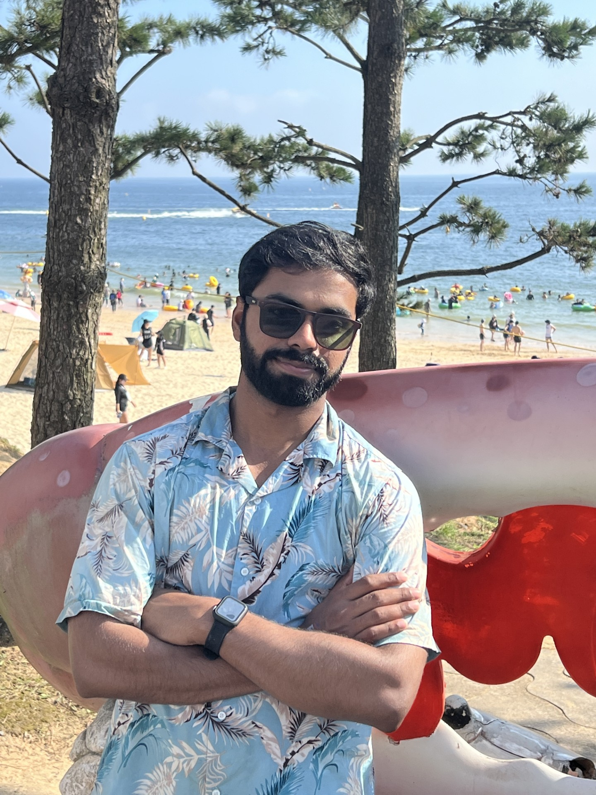

### Abdul Rehman | AI Enthusiast & Researcher

💻 *Building innovative AI solutions since 2018*  
🚀 *Pushing boundaries in Signal Processing, Image Processing, ML, DL & NLP*

  

I am Abdul Rehman, passionate about solving real-world problems through AI. With expertise spanning across multiple domains, I constantly explore new ways to innovate and share my findings with the research community through published articles. I am currently working on several exciting projects that I'll soon share here. Let's connect and collaborate!

### 🛠️ Skills & Tools

- **Programming Languages:** Python, C++, C, MATLAB, Verilog
- **AI/ML Frameworks:** TensorFlow, PyTorch, Keras, Scikit-learn, OpenCV
- **Development Tools:** Jupyter, Docker, Git
- **Databases:** MySQL, MongoDB
- **Cloud Services:** AWS, Google Cloud, Azure

Feel free to reach out if you have any questions, suggestions, or need assistance with your own projects. Stay tuned for updates!

